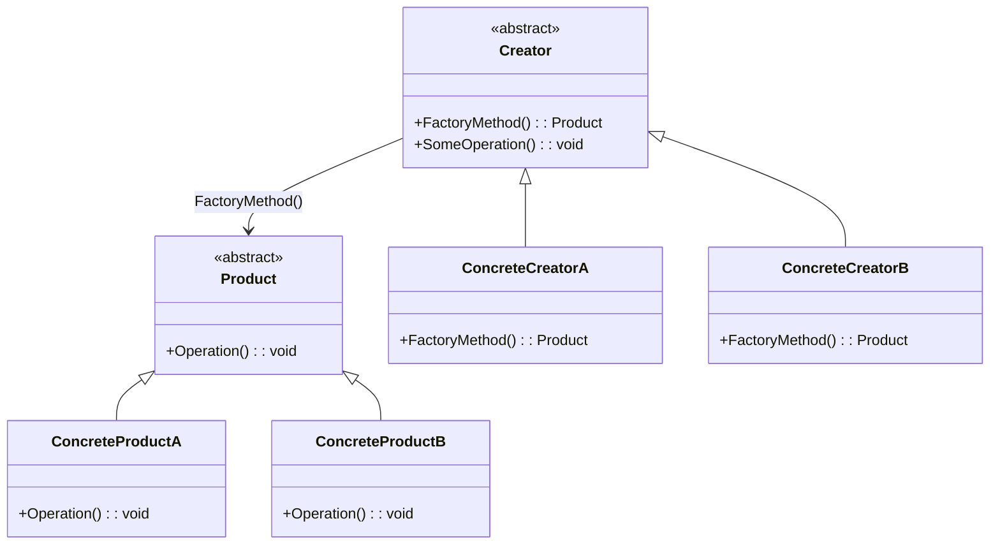
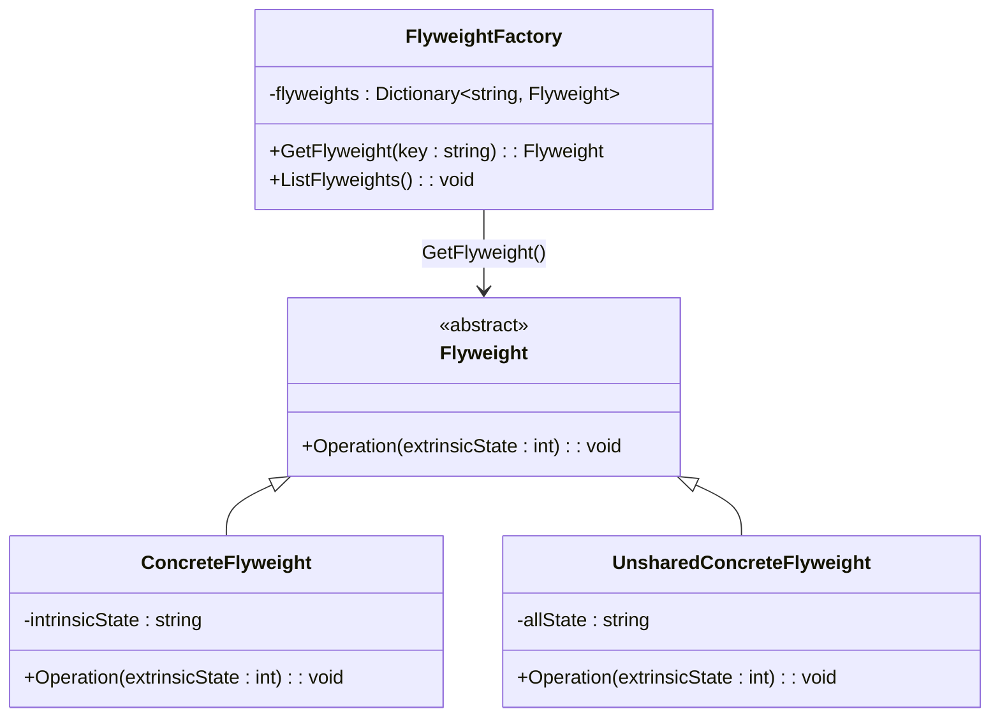

# dot-net-labs-rgr

# C# Design Patterns

## Factory Method

### UML Diagram


### factory-methode c# code
```csharp
using System;

// Продукт
public abstract class Product
{
    public abstract void Operation();
}

// Конкретний продукт A
public class ConcreteProductA : Product
{
    public override void Operation()
    {
        Console.WriteLine("Operation of ConcreteProductA");
    }
}

// Конкретний продукт B
public class ConcreteProductB : Product
{
    public override void Operation()
    {
        Console.WriteLine("Operation of ConcreteProductB");
    }
}

// Створювач
public abstract class Creator
{
    public abstract Product FactoryMethod();

    public void SomeOperation()
    {
        // Використання фабричного методу для створення продукту
        var product = FactoryMethod();
        product.Operation();
    }
}

// Конкретний створювач A
public class ConcreteCreatorA : Creator
{
    public override Product FactoryMethod()
    {
        return new ConcreteProductA();
    }
}

// Конкретний створювач B
public class ConcreteCreatorB : Creator
{
    public override Product FactoryMethod()
    {
        return new ConcreteProductB();
    }
}

class Program
{
    static void Main(string[] args)
    {
        // Використання конкретного створювача A
        Creator creatorA = new ConcreteCreatorA();
        creatorA.SomeOperation();

        // Використання конкретного створювача B
        Creator creatorB = new ConcreteCreatorB();
        creatorB.SomeOperation();
    }
}

```
## flyweight

### UML Diagram


### flyweight c# code
```csharp
using System;
using System.Collections.Generic;

// Flyweight
public abstract class Flyweight
{
    public abstract void Operation(int extrinsicState);
}

// ConcreteFlyweight
public class ConcreteFlyweight : Flyweight
{
    private string intrinsicState;

    public ConcreteFlyweight(string intrinsicState)
    {
        this.intrinsicState = intrinsicState;
    }

    public override void Operation(int extrinsicState)
    {
        Console.WriteLine($"ConcreteFlyweight: Intrinsic State = {intrinsicState}, Extrinsic State = {extrinsicState}");
    }
}

// UnsharedConcreteFlyweight
public class UnsharedConcreteFlyweight : Flyweight
{
    private string allState;

    public UnsharedConcreteFlyweight(string allState)
    {
        this.allState = allState;
    }

    public override void Operation(int extrinsicState)
    {
        Console.WriteLine($"UnsharedConcreteFlyweight: All State = {allState}, Extrinsic State = {extrinsicState}");
    }
}

// FlyweightFactory
public class FlyweightFactory
{
    private Dictionary<string, Flyweight> flyweights = new Dictionary<string, Flyweight>();

    public Flyweight GetFlyweight(string key)
    {
        if (!flyweights.ContainsKey(key))
        {
            flyweights[key] = new ConcreteFlyweight(key);
        }
        return flyweights[key];
    }

    public void ListFlyweights()
    {
        Console.WriteLine($"FlyweightFactory: {flyweights.Count} flyweights in total.");
        foreach (var key in flyweights.Keys)
        {
            Console.WriteLine(key);
        }
    }
}

class Program
{
    static void Main(string[] args)
    {
        var factory = new FlyweightFactory();

        // Using shared flyweights
        var flyweight1 = factory.GetFlyweight("State1");
        var flyweight2 = factory.GetFlyweight("State2");
        var flyweight3 = factory.GetFlyweight("State1");

        flyweight1.Operation(1);
        flyweight2.Operation(2);
        flyweight3.Operation(3);

        factory.ListFlyweights();

        // Using unshared flyweight
        var unsharedFlyweight = new UnsharedConcreteFlyweight("Unshared State");
        unsharedFlyweight.Operation(4);
    }
}

```

